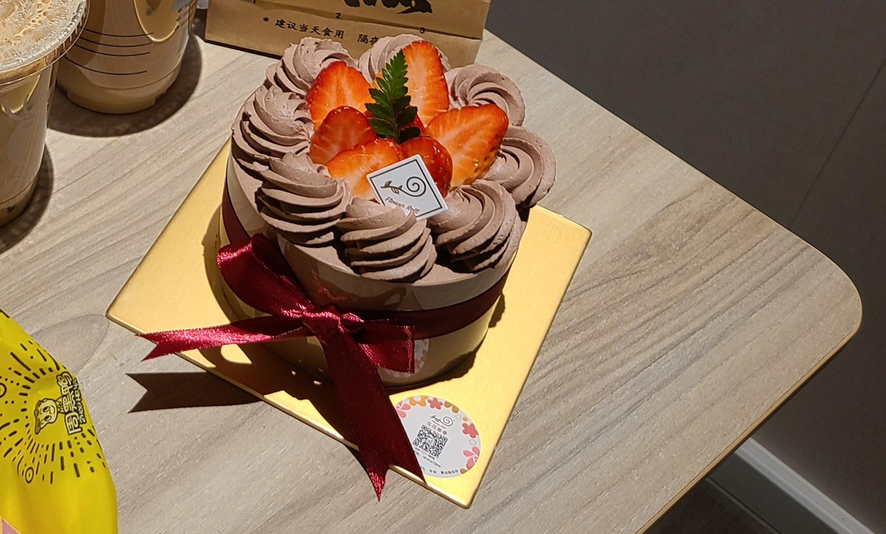

# ECNU-Assault-Guide
华师大冲锋指南，记录一下探店反馈。该页面为总名单，按照好评、中等、差评顺序,标记分别为&#x1F44D; &#x2753; &#x1F44E;。如需不同分类方式，可点击对应文件如 **按地址.md** 

# 金沙江路-鸡公煲 &#x1F44D;
吃了很多次，味道尚可，中规中矩，人均30，性价比较高，涮菜性价比较低。口味不如梅川路与凯旋北路鸡公煲

# 金沙江路-香酥鸡蛋灌饼 &#x1F44D;&#x1F44D;
研一上最爱之一，吃过的舍友均给出好评，性价比高，最低7元

# 环球港-西树泡芙 &#x1F44D;
连锁店没什么可说的，有人可能没吃过所以记录下，抹茶味挺好吃，人均20

# 环球港-山葵伴-料理寿喜烧 &#x1F44D;
吃过几次，店面较小，山葵酱味道挺好，寿司就是典型日料半成品风味，挺好吃。和牛激春卷好吃，鹅肝好吃，大虾天妇罗好吃，蟹宝好吃。人均100+

# 海底捞-火锅 &#x1F44D;
这个不用介绍了，不过虽然吃的不少，还是觉得性价比不高，学生优惠时段去吃个热闹。人均130（学生优惠）

# 环球港-左庭右院-鲜牛肉火锅 &#x1F44D;
挺好吃，价位较高，牛肉新鲜，味道香。人均130+

# 环球港-高老九-重庆火锅 &#x1F44D;
奔着辣而来，结果不辣，让服务员加了好几次辣，聊胜于无。不过总归锅底还是挺香的，牛蛙不错，碰到活动时来吃挺好。人均100（打折价）

# 曹杨路-鸡公煲纸包鱼 &#x1F44D;
和马哥闲逛时遇到的，味道还不错，但对比金沙江路优势不大。人均40

# 长风大悦城-丰圆轩-粤式茶楼 &#x1F44D;&#x1F44D;
广式早茶，风味与点都德差不多，挺好吃。
乳鸽难吃，红米肠好吃，虾饺好吃，干炒牛河好吃，艇仔粥好吃，贵妃豆腐还行。人均80

# 大渡河路-大嘴蛙（一只蛙）-炭火蛙锅 &#x1F44D;&#x1F44D;
阮兄推荐，位置很偏，味道很好，蛙锅与地锅鸡都很好吃，价格实惠，去了好几次。人均60+

# 大渡河路-川湘小厨-川湘菜 &#x1F44D;
非常实惠的小馆子，环境一般，隔壁就是菜市场可以买海鲜加工。干锅牛蛙好吃，湘味家常鱼好吃，铁锅仔鸡好吃，农家土鸡好吃，红烧鲤鱼好吃，鲫鱼豆腐汤好吃，干锅牛杂难吃。人均60

# 长风大悦城-磁石-美式汉堡 &#x1F44D;
连锁汉堡店，味道还不错，但没有Fat Cow好吃。人均80

# 环球港/长风大悦城-江边城外-烤鱼 &#x1F44D;
怪味烤鱼是甜辣口，挺好吃，不过吃两次就腻了，别的味道不好吃。人均80

# 环球港-江南里-杭帮菜 &#x1F44D;
吃了好几次，上菜很快应该是中央厨房做的，不过口味挺好吃。
石锅牛蛙好吃，虎皮青椒一般，鱼羹好吃，蛋黄鸡翅不错，沸腾鱼虾一般，清炒虾仁不错。人均80

# 环球港-超级迷你椰-泰餐 &#x1F44D;
吃了三次，性价比很高，不过应该是中央厨房预制菜。
冬阴功汤不错，咖喱鸡好吃，咖喱牛肉好吃，河内鲜虾卷还行，金边炒粉好吃，香茅鸡还行，鸡肉嘎抛还行，泡面杯难吃，椰奶西米糕一般。人均70

# 连锁-牛new寿喜烧-寿喜烧自助 &#x1F44D;&#x1F44D;
吃了两次，主要吃涮牛肉，好吃，脂香浓郁，吃多了会腻。冰淇淋也不错。海鲜拼盘里扇贝不错，很肥。喜欢吃寿喜烧的推荐尝试。人均168

# 环球港-炊烟小炒黄牛肉-湘菜 &#x1F44D;
网红店，排队很多，值得吃但不值得排队，建议工作日去。小炒黄牛肉不错，手捣茄子好吃，海皇粉丝煲不错。

# 环球港-花花卷卷-蛋糕 &#x1F44D;
从地铁站一进去就能看到，动物奶油，低糖，很香醇好吃。一个6寸约100

# 环球港-费大厨辣椒炒肉-湘菜 &#x1F44D;
和炊烟一样的网红店，不值得排队，味道还可以。手捣茄子好吃。人均100

# 环球港-烤肉终结者-韩式烤肉 &#x1F44D;
烤肉一般都挺好吃的，这家主打猪肉，味道还可以。人均100

# 静安区-火烧云-云南菜 &#x1F44D;
网红店，油焖鸡好吃，鱼锅更好吃，价位较高，值得吃，值得稍微排队。人均100

# 长风大悦城-圣泰帕府-泰国菜 &#x1F44D;
主打螃蟹，我没舍得吃。咖喱鸡和冬阴功汤不错，价位比迷你椰高但口味并不高太多，除非为了环境，建议去迷你椰。人均100+

# 环球港-baker bee-面包 &#x1F44D;
这家的伯爵红茶生奶油很好吃，面包松软，馅料层次丰富，动物奶油，22一个

# 金沙江路-杨松芳米皮-西北面 &#x1F44D;
别的面出品不太稳定，重点在于川香牛肉面很辣，马哥涕泪横流，爱吃辣的建议品尝。人均22

# 中江路-河南胡辣汤-面馆 &#x1F44D;
胡辣汤是我在上海喝过最好的，炒饭与面不错。人均30

# 环球港-谷牛·和牛烧肉-烤肉 &#x1F44D;
烤肉很香，价位较高，人均130+

# 环球港-KUMOKUMO-芝士蛋糕 &#x1F44D;
性价比较高，味道不错，网红店不值得排队。原味芝士蛋糕39一个

# 长风大悦城-聚九门老北京涮肉-鲜羊肉铜锅 &#x1F44D;
锅底费很便宜，可以选小锅，一个人也能吃。鲜羊肉风味浓郁，沾麻酱很香。人均100

 

# 梅川路/真光路-二楼老店重庆鸡公煲 &#x1F44D;&#x1F44D;
上海最出名的鸡公煲，人声鼎沸，节假日必大排长龙。好吃，不建议排队，建议工作日中午前往。价位作为鸡公煲较高。人均70

# 梅川路-潮香记-潮汕牛肉火锅 &#x1F44D;&#x1F44D;
套餐性价比高，牛肉与牛肉丸品质不错，沾沙茶酱很好吃，潮汕牛肉火锅较清淡，吃完不腻，建议尝试。人均100+

# 大渡河路-小蜜蜂-烧烤 &#x1F44D;&#x1F44D;
阮兄推荐小店，位置较偏，菜品较少，口味很好，菜单上都建议尝试，比岩儿姐好吃很多，店也干净。

# 长风大悦城-东盛碳烤自助料理-烤肉自助 &#x1F44D;
味道不错，作为自助来说烤肉很香，品质尚可，建议尝试。人均130

# 凯旋北路-重庆鸡公煲村夫烤鱼 &#x1F44D;&#x1F44D;
店面较小，卫生一般，口味很不错，辣椒很足，华师大周边鸡公煲最佳选择（洁癖除外）。人均50

# 虹桥南丰城-莲池-印度菜 &#x1F44D;&#x1F44D;
老板印度人，咖喱鸡很好吃，饼很好吃，玛德拉斯羊肉还行。印度拉茶里放了玛萨拉，香料味重。人均80

# 静安区-Fat Cow-美式汉堡 &#x1F44D;&#x1F44D;
上海很出名的美式汉堡，牛肉很香，性价比不错，喜欢美式汉堡的建议尝试。人均70+

# 中山北路-敦煌楼-西北菜 &#x1F44D;&#x1F44D;
据说是上海最出名的西北菜，前身是甘肃驻沪办食堂，据说羊肉是宁夏运来的。手抓羊肉不腻不膻，肉质鲜美。黄焖羔羊肉色香味俱全，牛肉面也不错，喜欢吃羊肉的必来。人均90

# 环球港-城南往事-鲁菜 &#x1F44D;
连锁鲁菜店，价位较高，特色是烤鸭，口味不错，适合三人以上来吃。浓汤海鲜泡爆米挺好吃。人均130+

# 枣阳路-长风清真馆 &#x2753;
牛肉盖浇面难吃到人神共愤、孜然羊肉炒饭好吃，人均20+

# 环球港-小杨生煎 &#x2753;
很出名的连锁店，味道不错，就是蟹粉生煎没吃出蟹味，我对生煎兴趣较小，只会去一次尝尝鲜。人均30

# 环球港-漫驼铃-新疆菜 &#x2753;
大盘鸡口味还可以，菜品中规中矩，不过被敦煌楼吊打。人均80

# 凯旋北路-岩儿姐撸串儿-烧烤 &#x2753;
味道一般，被小蜜蜂吊打，胜在便宜，人均60

# 徐家汇-柠檬草-泰国菜 &#x2753;
人挺少，只尝了黄咖喱炒软壳蟹，咖喱不错，软壳蟹难吃，建议尝试别的菜。人均100+

# 环球港-Hello Kive-乌克兰餐厅 &#x2753;
口味中规中矩，午市套餐性价比较高。红菜汤不错但番茄酱味很重，沙拉难吃，小煎饼不错，主菜春鸡配香肠一般。只会去一次尝鲜。人均100

# 金沙江路-黄焖鸡 &#x1F44E;
入口即亏，人均30

# 环球港-天辣-川菜 &#x1F44E;&#x1F44E;
吃了两次，一言难尽，入口即亏，只有咸辣，人均100

# 凯旋北路-疆里疆外-新疆菜 &#x1F44E;
量很少，味道一般，大盘鸡就一点点，性价比低，属实不建议来。人均80

# 环球港-鳗葉东京食堂-日料 &#x1F44E;
说是主打鳗鱼饭，还分关西口味关东口味，吹的挺响结果就是半成品加工。不能说难吃，但名字误导人，去这里吃鳗鱼饭属于没有必要（淘宝搜索蒲烧鳗鱼）。人均100

# 凯旋北路-东北庄稼院-铁锅炖 &#x1F44E;
团建去过一次，点的铁锅炖鸡，整体味道一般，贴饼和豆角味道还不错，不过被大嘴蛙的地锅鸡吊起来打。只会去一次。人均70

# 环球港-荣先森-闽南菜 &#x1F44E;&#x1F44E;
在抖音领到优惠券，当即叫上马哥前哥冲锋。出发时笑逐颜开，吃完怒发冲冠。海蛎煎是苦的，东山小管入口即亏。黄花鱼汤倒是挺好喝，然而一份好像是70元，不够三个人喝。改名叫黄金鱼得了。（盒马鲜生宁德大黄鱼20元一条）。人均80（打折后，且吃不饱）

# 连锁-蛙来哒-蛙锅 &#x1F44E;&#x1F44E;
特色紫苏牛蛙，量少且肉少，味道一般，再也不去。人均80

# 中江路-贾二姐江西米粉 &#x1F44E;
特辣米粉根本不辣，很油，只去一次。人均25

# 环球港-家有好面-黄鱼面 &#x1F44E;&#x1F44E;
一句话，入口即亏，人均20+

